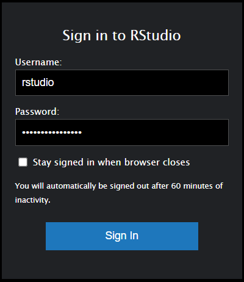
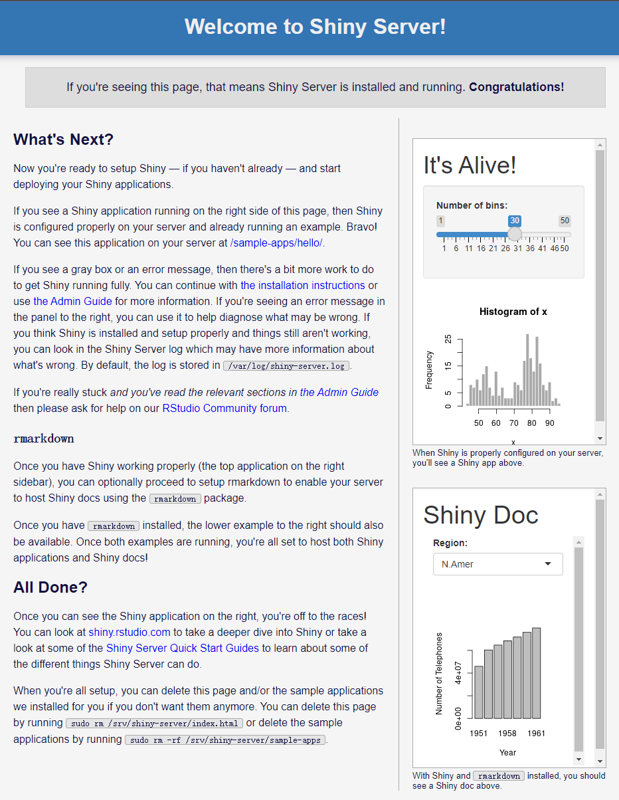

# [Elastic Compute Cloud](https://aws.amazon.com/ec2/)

```{r setup, include=FALSE}
knitr::opts_chunk$set(eval = FALSE)
```

[Getting Started with Amazon EC2](https://aws.amazon.com/ec2/getting-started/)

<iframe width="560" height="315" src="https://www.youtube.com/embed/JcsxpTFQ9pU" title="YouTube video player" frameborder="0" allow="accelerometer; autoplay; clipboard-write; encrypted-media; gyroscope; picture-in-picture" allowfullscreen></iframe>

## Docker

[Install Docker Engine on Ubuntu](https://docs.docker.com/engine/install/ubuntu/)

```{bash}
# Update the apt package index and install packages to allow apt to use a repository over HTTPS:
sudo apt-get update
sudo apt-get install -y ca-certificates curl gnupg lsb-release
    
# Add Docker’s official GPG key:
curl -fsSL https://download.docker.com/linux/ubuntu/gpg | \
  sudo gpg --dearmor -o /usr/share/keyrings/docker-archive-keyring.gpg

# Use the following command to set up the stable repository.
echo "deb [arch=$(dpkg --print-architecture) \
  signed-by=/usr/share/keyrings/docker-archive-keyring.gpg] \
  https://download.docker.com/linux/ubuntu $(lsb_release -cs) stable" | \
  sudo tee /etc/apt/sources.list.d/docker.list > /dev/null
  
# Update the apt package index, and install the latest version of Docker Engine, containerd, and Docker Compose.
sudo apt-get update
sudo apt-get install -y docker-ce docker-ce-cli containerd.io docker-compose-plugin

# Add your user to the docker group.
sudo usermod -aG docker $USER

# Run the following command to activate the changes to groups:
newgrp docker 

# Verify that you can run docker commands without sudo.
docker run hello-world
```

## RStudio

[Docker for RStudio Server](https://hub.docker.com/r/rocker/rstudio)

```{bash}
docker run -d -p 8787:8787 -e ROOT=TRUE -e PASSWORD=yourpasswordhere rocker/rstudio
```

`http://<public-ip-address>:8787`



## Shiny

[Docker for Shiny Server](https://hub.docker.com/r/rocker/shiny)

```{bash}
docker run -d -p 3838:3838 rocker/shiny
```

`http://<public-ip-address>:3838`



## Jupyter

[Docker for Jupyter Server](https://hub.docker.com/r/jupyter/datascience-notebook)

```{bash}
docker run -d -p 8888:8888 jupyter/datascience-notebook
```

`http://<public-ip-address>:8888`


